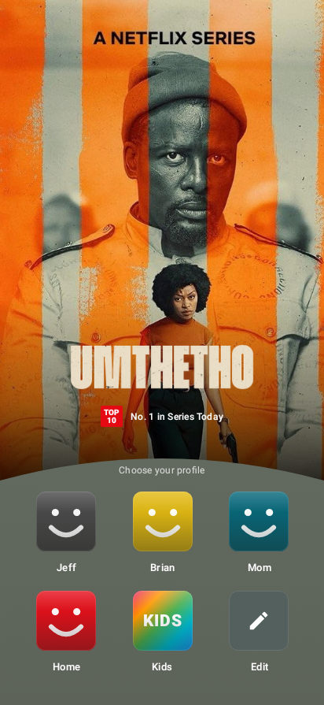
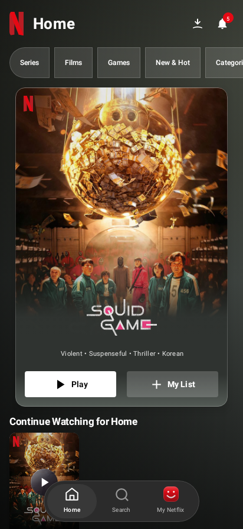
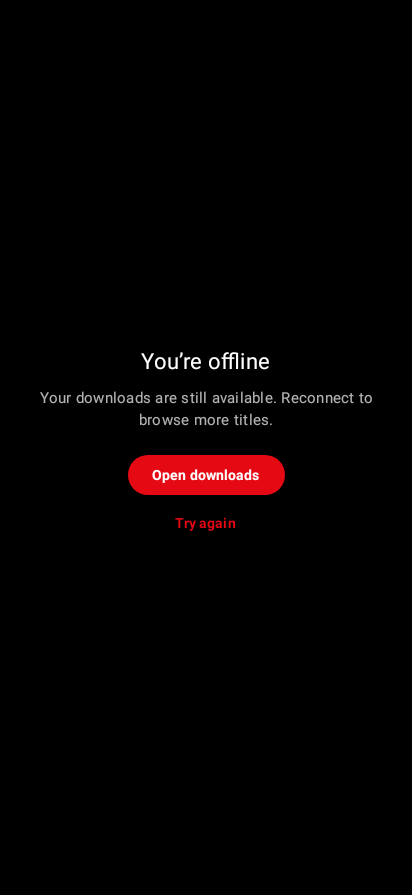

# Mobile design previews

Captured from the actual Compose screens using Robolectric native Android 34 graphics (412 × 895). Production artwork comes from the current TMDB trending catalog, filtered for the active profile. These deterministic tests use TMDB poster/title-logo fixtures and extract the footer/background colors from the actual image. The image fixtures are test resources and are excluded from the APK. These previews do not establish emulator startup or physical-device performance. Home uses the original custom download icon and 52 dp translucent category tabs: rounded outer ends and flat inner edges. The hero has a 16 dp silhouette, subtle elevation and a graded rim; its footer uses the extracted poster color rather than black. Bottom padding is 2 dp, tightening the first-row gap without changing the spacing between catalog rows. The header/ambient background and hero footer follow the current trending poster. The outlined Home icon remains in the wider bottom capsule. The selected trending artwork changes independently of the reference image; the reference poster is not bundled into production.

