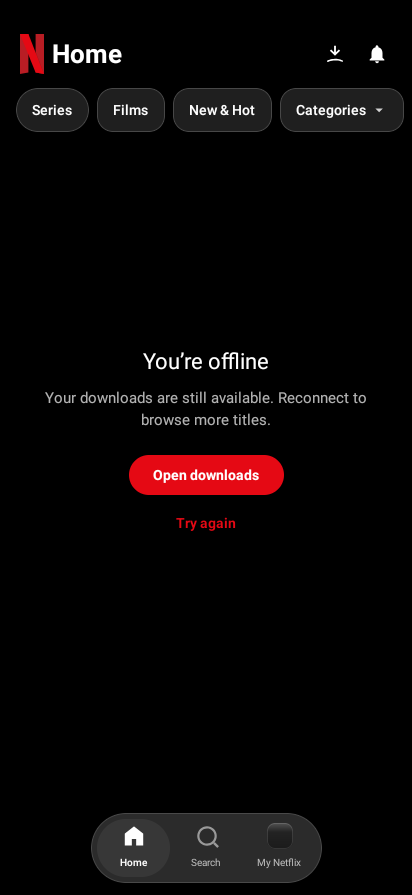
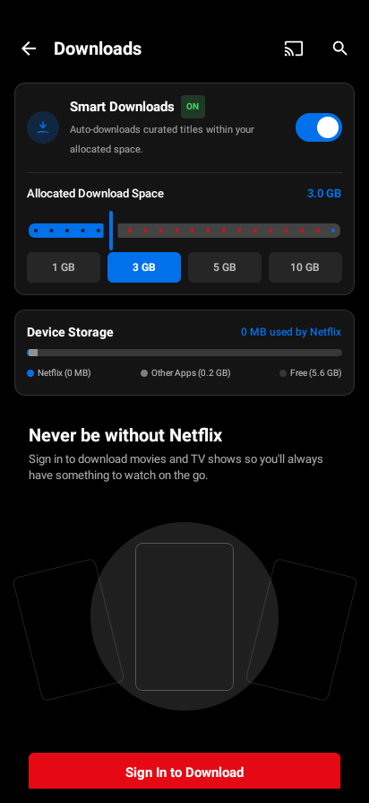

# Offline emulator check

Captured from the debug app running on an Android 9/API 28 software emulator at 412 × 895. Wi-Fi and mobile data were disabled before launch; Android reported no active default network. Onboarding opened, Browse as Guest reached the offline Home state, and Open downloads reached the guest downloads screen. No AndroidRuntime fatal exception occurred during this check.

These are runtime screenshots, separate from the deterministic TMDB design previews. This test uses an empty guest download library; it does not validate offline playback, signed-in cached profiles, process-death download restoration or real-device performance.

