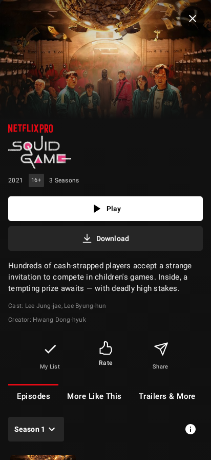
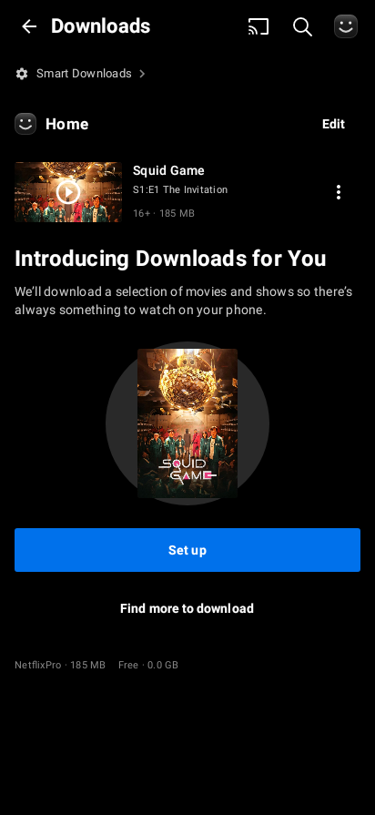
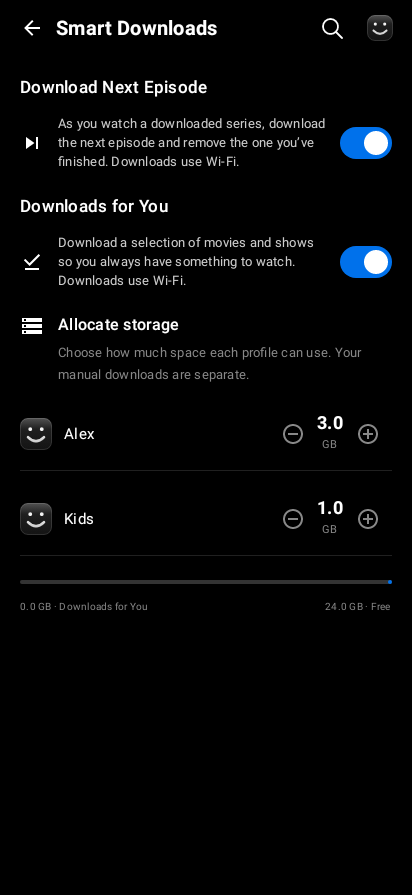
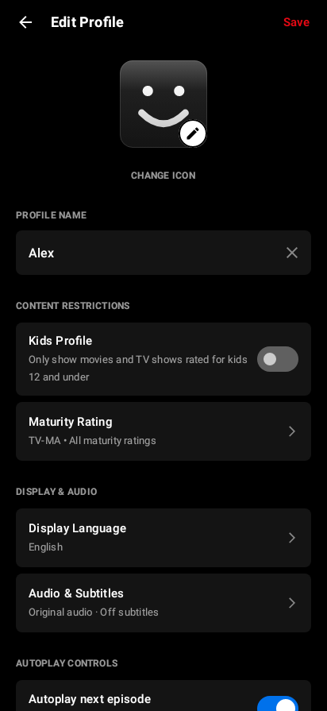
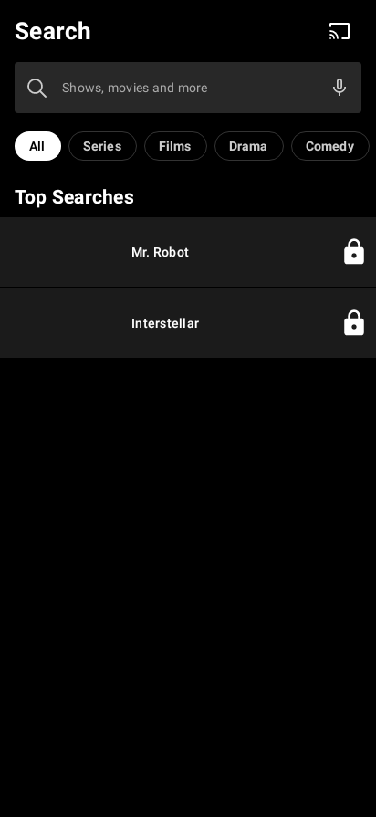

# NetflixPro mobile refinement

The mobile app now shares NetflixPro branding, download actions and playback completion behavior across Home, Details, Downloads and the player. The existing floating bottom navigation remains on Home/Search; full-screen Details, Downloads, Smart Downloads and Profile Edit cover it.

## UI and navigation

- Home keeps the existing design while remembering artwork requests/gradients, giving lazy items stable identities and collecting transfer progress only where it is displayed.
- Details uses TMDB title logos with readable text while loading or when unavailable, poster-colored gradients, Resume progress, episode rows, season information and Episodes / More Like This / Trailers & More tabs. Previews respect profile preferences and stop when covered or backgrounded.
- Downloads groups series, provides consistent pause/retry/cancel actions, opens verified local files and separates manual downloads from Downloads for You. Smart Downloads and its storage setup have dedicated screens.
- Profile Edit saves names, avatars, maturity, PIN, autoplay, game handles and actual audio/subtitle preferences. Unsupported interface translations are not presented as available. Failed persistence keeps the editor open.
- Search supports real filters, voice input, loading/offline feedback and profile restrictions. All switches use the same blue track and white thumb.
- Bundled NetflixPro logos use their matching Android vector exports so branding renders on the first frame.

The supplied reference images guided the layout. Accessible research included [Netflix downloads](https://help.netflix.com/en/node/54816), [Download Next Episode](https://help.netflix.com/en/node/101262), [profile management](https://help.netflix.com/en/node/10421), [Compose performance guidance](https://developer.android.com/develop/ui/compose/performance/bestpractices) and the public [Netflix mobile flow index](https://uxmagic.ai/references/Netflix-iOS). The latter's full images require sign-in; no unseen images were used or represented as official 2026 UI.

## Download lifecycle

WorkManager owns constrained foreground transfers independently of Activity/ViewModel lifetime. Request metadata and pause/error states are written atomically outside Android backup; expiring resolved URLs and cookies are not saved as download requests. The service exposes a progress notification and Pause action. Resuming restores the original media/episode metadata and resolves fresh stream URLs.

Transfers have bounded network retries, cancellation that closes requests, account/profile ownership checks, per-download serialization and two concurrent transfer slots. A 401/403 permits one normal provider session renewal before normal retry/error handling. Direct transfers validate ranges and validators. Supported HLS downloads checkpoint whole MPEG-TS segments with synced files and SHA-256 receipts, reuse them across token changes, and rebuild output without partial or duplicated segments. A completion journal protects the rename-to-database-save boundary. Available caption files are stored locally.

Download Next Episode and Downloads for You are independent opt-ins, with per-profile allocations and Wi-Fi constraints. Episode replacement requires actual playback completion, keeps the final episode of a series, and defers removal of the currently playing offline file until the viewer leaves it so Watch again remains available.

Room migration 7→8 preserves existing profile/download data while adding track preferences and automatic-download ownership. The mobile Firebase configuration matches the TV configuration.

## Playback

Resume retains season/episode coordinates even from lightweight Home items. Cross-season next-episode metadata is prepared near the end. Completion offers Watch again, rating, browsing and recommendations; countdowns pause for backgrounding/overlays and Watch credits cancels autoplay. Actual tracks and preferred language codes drive audio/subtitle selection. Optional VTT seek thumbnails have bounded transfer/decode/cache sizes and never delay initial playback.

## Validation

Run from the repository after sourcing the configured cloud toolchain:

```bash
source /workspace/cloud-setup/env.sh
gradle :app:testDebugUnitTest :app:assembleDebug --max-workers=2
gradle :app:lintDebug --max-workers=2
```

The complete unit/UI suite passed: **95 tests, 0 failures, 0 errors, 10 skipped** (85 passed; skipped tests are opt-in film exports). Android lint passed with no errors. The four Home scroll regressions also passed independently after a category-state capture fix; their paused-looper harness explicitly delivers off-main section results. Debug assembly and APK signature verification passed for version **1.4 / code 5**.

Review captures in `mobile-refinement/` render production Kotlin Composables using native Robolectric graphics and local TMDB artwork fixtures. They are UI reviews, not emulator screenshots, measured device performance or successful live-provider playback. Tests cover durable queued requests, ownership, pause/resume/cancel, a 170-segment transfer failing at segment 165 then resuming with renewed tokens, tamper/partial detection, migration preservation, profile preferences, independent Smart Download switches, Details interaction/lazy episodes and player completion behavior.

Encrypted and byte-range HLS remain unsupported. Separate-audio HLS now uses local playlists with video/audio checkpoints, including fMP4 initialization segments and preserved discontinuities; see [Home and download follow-through](mobile-home-performance.md). The older single-file TS path retains its stricter format limits. Android foreground execution, OEM battery policies, force-stop recovery and live-provider session behavior require runtime validation on representative devices. Debug APKs are review builds; release signing and production certification remain separate.

## Native UI review






